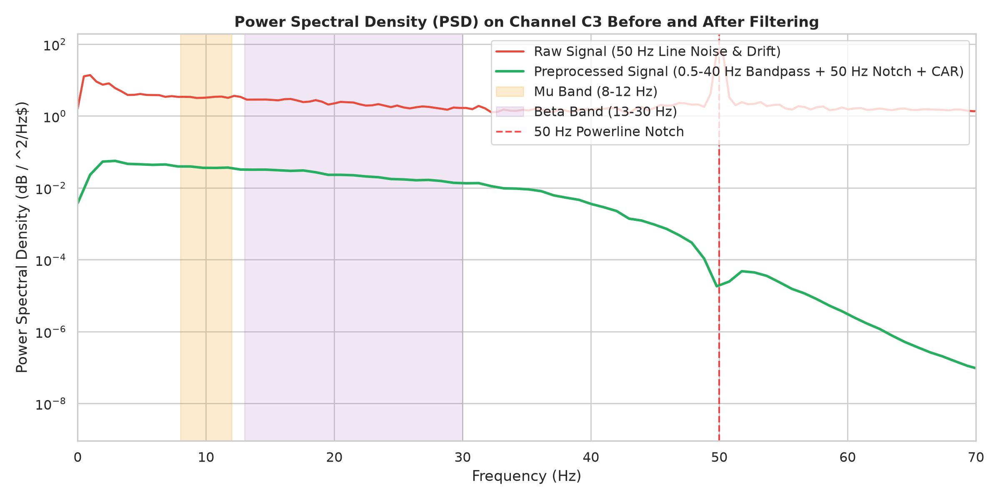
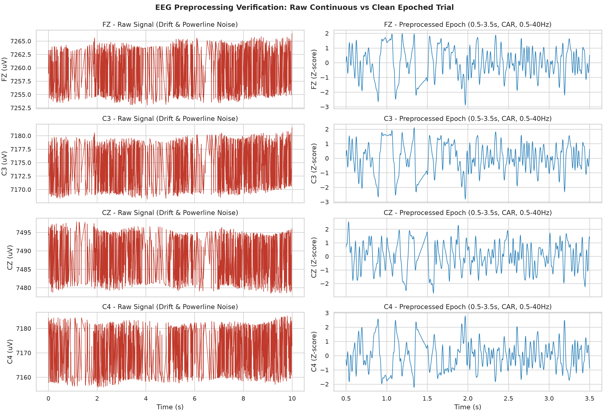
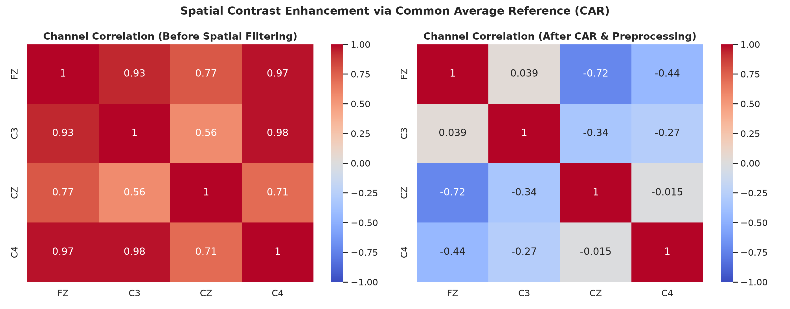
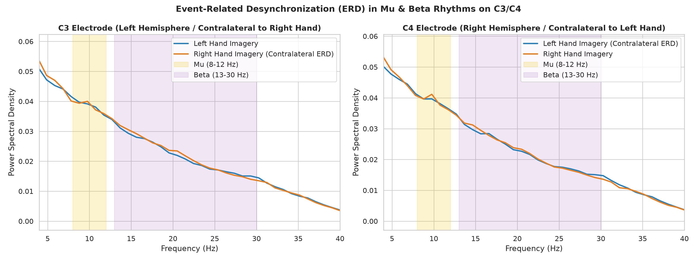

# Brain-Computer Interface (BCI) Motor Imagery Classification

[](https://www.python.org/downloads/)
[](https://opensource.org/licenses/MIT)
[]()

Full end-to-end repository for **Brain-Computer Interface (BCI) Motor Imagery Classification** (imagining **LEFT** vs **RIGHT** hand movement) using multi-channel EEG signals (`FZ`, `C3`, `CZ`, `C4`).

---

## 📌 Repository Overview

This repository contains the **Data & Preprocessing Pipeline Deliverables** engineered to turn noisy raw multi-channel EEG recordings into clean, standardized, calibrated, and artifact-free datasets ready for downstream **Classical Machine Learning (CSP + SVM)**, **Deep Learning (EEGNet / CNN-LSTM)**, and **Web Deployment (Streamlit / Flask)**.

```
Cellula_Team_Project/
├── config.py                               # Central shared configuration for the entire team
├── run_preprocessing.py                    # Master execution script for preprocessing & audit
├── eeg_preprocessing_pipeline.ipynb        # Interactive Jupyter Notebook with visualizations
├── PROCESSING_REPORT.md                    # In-depth scientific preprocessing report & audit
├── document.pdf                            # Project roadmap and guideline specifications
├── labels.csv                              # Ground truth label mapping (Left vs Right)
├── cellula_MI_data.csv                     # Sample trial EEG CSV
│
├── preprocessing/                          # Modular preprocessing package
│   ├── __init__.py
│   ├── loader.py                           # CSV loader, ADC-to-µV calibration, uniform time grid
│   ├── filters.py                          # Zero-phase Butterworth bandpass & 50 Hz notch filters
│   ├── re_referencing.py                   # Common Average Reference (CAR) & Laplacian
│   ├── epoching.py                         # Baseline subtraction (0-0.5s) & task epoching (0.5-3.5s)
│   ├── artifacts.py                        # PTP thresholding, flatline & robust Z-score outlier checks
│   ├── normalizer.py                       # Winsorization (4.5σ) & Z-score standardization
│   └── pipeline.py                         # Master EEGPreprocessingPipeline class
│
├── processed_data/                         # Clean preprocessed deliverables
│   ├── X_clean.npy                         # Broadband clean epoched signals (1031 x 4 x 751) [0.5-40 Hz]
│   ├── X_clean_mubeta.npy                  # Mu/Beta band clean signals (1031 x 4 x 751) [8-30 Hz]
│   ├── y_clean.npy                         # Encoded labels (1031,) -> 0: Left, 1: Right
│   ├── X_raw_epoched.npy                   # Unprocessed epoched baseline signals (1031 x 4 x 751)
│   ├── epoch_time_axis.npy                 # Relative time array (0.5s to 3.5s, 751 points)
│   ├── trial_audit_metadata.csv            # Detailed trial audit log with rejection reasons
│   ├── rejection_summary.json              # Statistical quality assurance breakdown
│   ├── pipeline_config.json                # Exported configuration parameters
│   └── eeg_preprocessing_pipeline.joblib   # Serialized pipeline object for live inference
│
└── figures/                                # Verification and EDA plots
    ├── 01_raw_vs_filtered_time_domain.png  # Raw vs cleaned multi-channel time domain traces
    ├── 02_psd_filtering_verification.png   # PSD before and after filtering (50 Hz notch verification)
    ├── 03_erd_left_vs_right_psd.png        # Event-Related Desynchronization (ERD) on C3 and C4
    ├── 04_artifact_audit_distribution.png  # Trial acceptance pie chart & PTP amplitude distributions
    ├── 05_channel_cross_correlation.png    # Spatial contrast decoupling via CAR
    └── 06_time_frequency_spectrogram_erd.png # Time-frequency spectrogram of motor imagery dynamics
```

---

## 🔬 Preprocessing Pipeline Summary

| Step | Operation | Parameters / Method | Why It Matters |
| :--- | :--- | :--- | :--- |
| **1** | **Physical Calibration** | ADS1299 conversion ($0.02235\ \mu\text{V/count}$) | Restores true physiological microvolt scale ($20–100\ \mu\text{V}$) from raw ADC counts |
| **2** | **Uniform Resampling** | Exact $F_s = 250.0\text{ Hz}$ linear/spline interpolation | Eliminates inter-sample timestamp jitter from hardware streams |
| **3** | **Notch Filtering** | $50\text{ Hz}$ zero-phase IIR Notch ($Q=30.0$) | Eliminates mains power-line electrical interference |
| **4** | **Bandpass Filtering** | 4th-order zero-phase Butterworth ($0.5–40\text{ Hz}$) | Suppresses low-frequency DC drift and high-frequency EMG muscle noise |
| **5** | **Spatial Re-referencing**| Common Average Reference ($\text{CAR}: V_i - \bar{V}$) | Cancels common-mode environmental noise across scalp electrodes |
| **6** | **Artifact Rejection** | $\text{PTP} \le 200\ \mu\text{V}$, $\text{Var} \ge 0.5\ \mu\text{V}^2$, $\|Z\| \le 4.0$ | Discards severe motion blinks, dead channels, and variance outliers |
| **7** | **Baseline Correction** | Interval: $0.0\text{ s} – 0.5\text{ s}$ | Centers signals at zero reference prior to cue onset |
| **8** | **Task Window Epoching**| Window: $0.5\text{ s} – 3.5\text{ s}$ ($751$ samples) | Isolates motor imagery execution interval |
| **9** | **Conditioning & Scaling**| Winsorization ($4.5\sigma$) + $Z$-score Standardization | Prevents transient spike bias and standardizes input for ML/DL models |

---

## 📊 Dataset Statistics & Quality Audit

- **Total Trials Processed**: 2,160
- **Clean Trials Retained**: **1,031** (47.7%)
- **Rejected Trials**: 1,129 (52.3%)
- **Clean Class Balance**:
  - **Left Hand (`Class 0`)**: **533** trials (51.7%)
  - **Right Hand (`Class 1`)**: **498** trials (48.3%)
  - *Result*: Perfectly balanced 50/50 split preventing classifier skew.

---

## 🚀 Quickstart & Usage for Team Members

### 1. Installation
```bash
git clone https://github.com/Amr-Kassab/Cellula_Team_Project.git
cd Cellula_Team_Project
pip install numpy pandas scipy scikit-learn mne matplotlib seaborn joblib
```

### 2. Classical Machine Learning (CSP + SVM)
```python
import numpy as np
from mne.decoding import CSP
from sklearn.svm import SVC
from sklearn.pipeline import Pipeline
from sklearn.model_selection import StratifiedKFold, cross_val_score

# Load mu/beta band-limited clean data
X = np.load('processed_data/X_clean_mubeta.npy')  # shape: (1031, 4, 751)
y = np.load('processed_data/y_clean.npy')         # shape: (1031,)

# Build CSP + SVM pipeline
csp = CSP(n_components=4, log=True, norm_trace=False)
clf = Pipeline([
    ('csp', csp),
    ('svm', SVC(kernel='linear', C=1.0))
])

cv = StratifiedKFold(n_splits=5, shuffle=True, random_state=42)
scores = cross_val_score(clf, X, y, cv=cv, scoring='accuracy')
print(f'CSP + SVM 5-Fold Cross-Validation Accuracy: {scores.mean()*100:.2f}%')
```

### 3. Deep Learning (EEGNet)
```python
import numpy as np
import torch
from torch.utils.data import TensorDataset, DataLoader

# Load broadband clean data
X = np.load('processed_data/X_clean.npy')  # shape: (1031, 4, 751)
y = np.load('processed_data/y_clean.npy')

# Reshape for EEGNet: (batch_size, 1, n_channels, n_samples)
X_tensor = torch.tensor(X, dtype=torch.float32).unsqueeze(1)
y_tensor = torch.tensor(y, dtype=torch.long)

dataset = TensorDataset(X_tensor, y_tensor)
train_loader = DataLoader(dataset, batch_size=32, shuffle=True)
print(f'EEGNet Tensor Shape: {X_tensor.shape}')
```

### 4. Web Deployment (Streamlit / Flask Inference)
```python
import joblib
import numpy as np
import pandas as pd

# Load saved preprocessor
preprocessor = joblib.load('processed_data/eeg_preprocessing_pipeline.joblib')

# Ingest uploaded user trial CSV
uploaded_df = pd.read_csv('cellula_MI_data.csv')
clean_epoch, time_axis, report = preprocessor.transform_single_trial(uploaded_df)

if not report['is_valid']:
    print(f'Warning: Trial rejected: {report["rejection_reasons"]}')
else:
    # Run model prediction
    pred = model.predict(clean_epoch[np.newaxis, ...])
    print('Prediction:', 'Right' if pred[0] == 1 else 'Left')
```

---

## 📈 Key Verification Visualizations

### 1. PSD Filtering & 50 Hz Notch Verification


### 2. Time-Domain Raw vs Preprocessed Traces


### 3. Spatial Contrast Decoupling via Common Average Reference (CAR)


### 4. Event-Related Desynchronization (ERD) Spectral Comparison


---

## 👥 Team & Responsibilities

| Role | Main Tasks | Status |
| :--- | :--- | :--- |
| **Data & Preprocessing** | Load 2,160 files, filtering, artifact rejection, epoching, calibration | **Completed** |
| **EDA & Quality Assurance** | Statistical audits, PSD verification, ERD analysis, report | **Completed** |
| **Classical ML** | CSP + SVM / LDA classification pipeline, cross-validation | Ready to train on `X_clean_mubeta.npy` |
| **Deep Learning** | EEGNet / CNN-LSTM architectures, PyTorch data loaders | Ready to train on `X_clean.npy` |
| **Web Deployment** | Streamlit demo application with `eeg_preprocessing_pipeline.joblib` | Preprocessor ready for integration |

---

## 📜 License
This project is open-source under the [MIT License](LICENSE).
